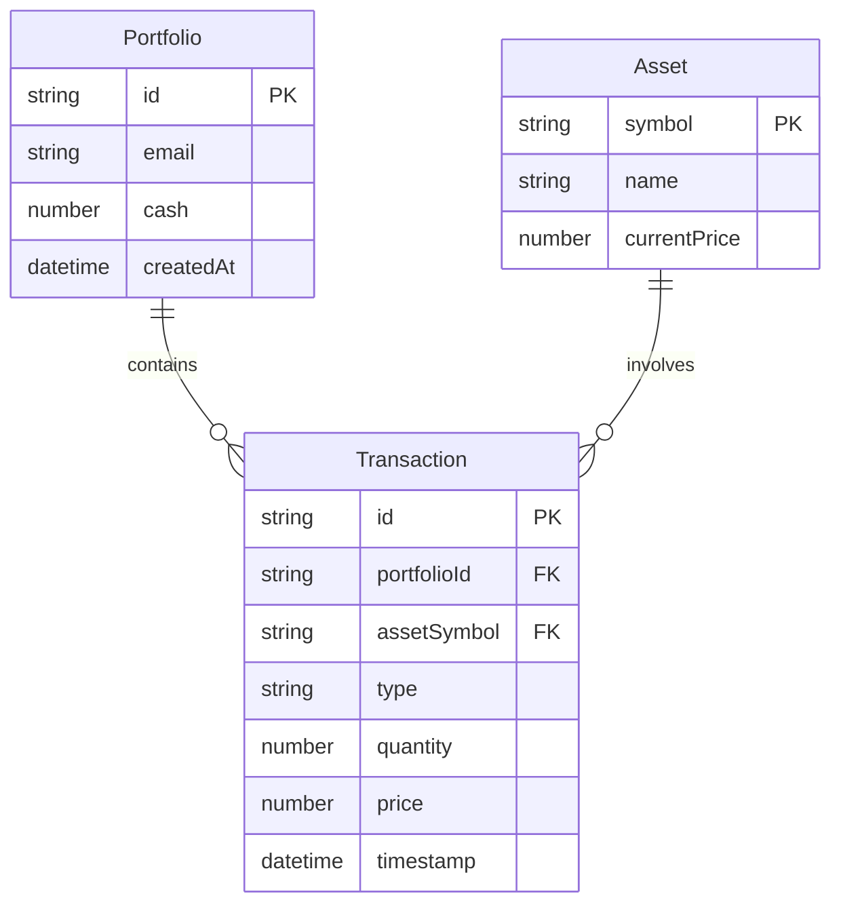

# Modelo de Datos para **AssetsBoard**

Este documento describe el modelo de datos para el proyecto **AssetsBoard**. Abarca las entidades principales, sus atributos y relaciones, y proporciona una representación visual mediante un diagrama Entidad-Relación.

Su objetivo es establecer un entendimiento común (lenguaje ubicuo) para la lógica de negocio y el diseño de sistemas.

## Entidades

### Portfolio

- Es una cartera de inversión que contiene cash disponible y está asociada a un email de usuario.
- **Atributos**:
  - **id**: string (required, unique) - Identificador único del portfolio
  - **email**: string (required) - Email del usuario propietario del portfolio
  - **cash**: number (required) - Cantidad de dinero disponible en el portfolio
  - **createdAt**: datetime (required) - Fecha de creación del portfolio

### Asset

- Es un activo financiero que puede ser comprado o vendido en el sistema.
- **Atributos**:
  - **symbol**: string (required, unique) - Símbolo del activo (ej: AAPL, TSLA)
  - **name**: string (required) - Nombre completo del activo
  - **currentPrice**: number (required) - Precio actual del activo

### Transaction

- Es una operación de compra o venta de activos realizada en un portfolio.
- **Atributos**:
  - **id**: string (required, unique) - Identificador único de la transacción
  - **portfolioId**: string (required) - ID del portfolio donde se realiza la transacción
  - **assetSymbol**: string (required) - Símbolo del activo involucrado en la transacción
  - **type**: enum(buy, sell) (required) - Tipo de operación (compra o venta)
  - **quantity**: number (required) - Cantidad de activos en la transacción
  - **price**: number (required) - Precio por unidad al momento de la transacción
  - **timestamp**: datetime (required) - Fecha y hora de la transacción

## Relaciones

- Un portfolio puede tener múltiples transacciones
- Una transacción pertenece a un único portfolio
- Una transacción está relacionada con un único asset
- Un asset puede participar en múltiples transacciones

## Diagrama de entidad-relación

