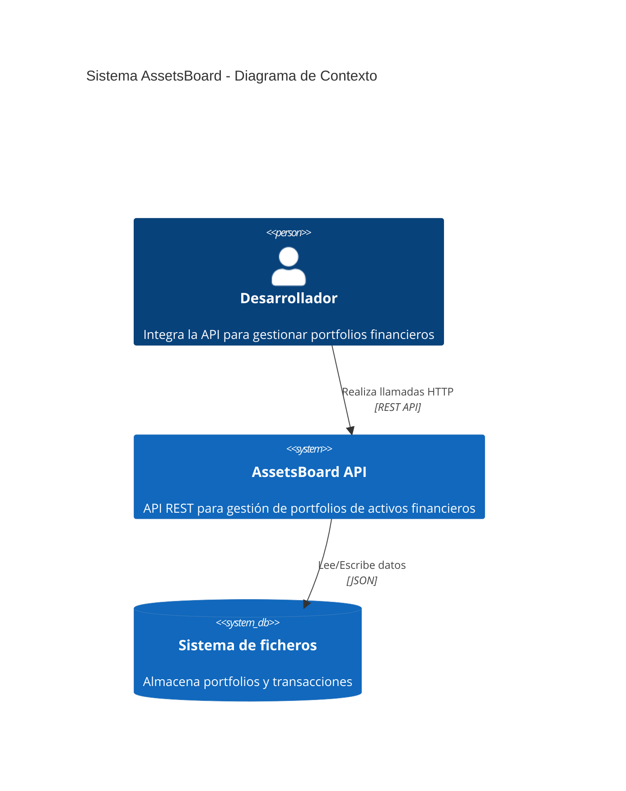

# **AssetsBoard** Project Requirements Document (PRD)

**AssetsBoard** es una API para desarrolladores que _proporciona endpoints para gestionar portfolios de activos financieros, permitiendo crear carteras, comprar/vender activos y consultar el estado de las inversiones_.

## Funcionalidades

### 1 Gestión de Portfolios

- Crear nuevos portfolios con email del usuario y cash inicial

- [1_gestion_portfolios#1](https://github.com/EscuelaIt/AIDD/issues/1)
- definido

### 2 Operaciones de Trading

- Comprar y vender activos donde el usuario especifica cantidad y precio

- [2_operaciones_trading#2](https://github.com/EscuelaIt/AIDD/issues/2)
- draft

### 3 Consulta de Portfolios

- Consultar el estado de un portfolio incluyendo cash restante y lista de activos

- [3_consulta_portfolios#3](https://github.com/EscuelaIt/AIDD/issues/3)
- draft

## Diagrama de contexto

---

## Especificaciones del sistema y contenedores

- **Interacción**: API
- **Niveles**: single-tier
- **Autenticación**: ninguna
- **Integraciones**: ninguna
- **Monitorización**: ninguno
- **Persistencia**: base de datos

### C_1: API REST

- Un express-api que proporciona endpoints REST para la gestión de portfolios de activos financieros

## Créditos

- **Autor**: [Alberto Basalo](https://albertobasalo.dev)
- **Empresa**: [EscuelaIT](https://github.com/EscuelaIt)
- **Repositorio**: [AssetsBoard](https://github.com/EscuelaIt/AIDD)

## Referencias de contexto

<!-- Esta sección se actualizará en otras fases del desarrollo -->
